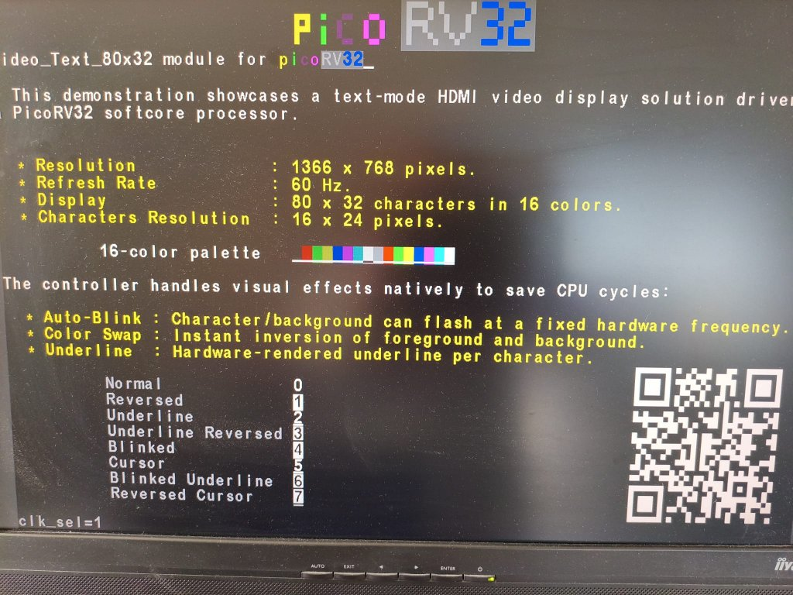
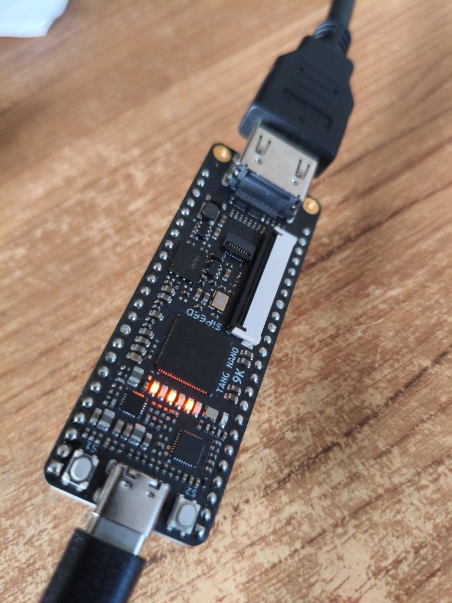
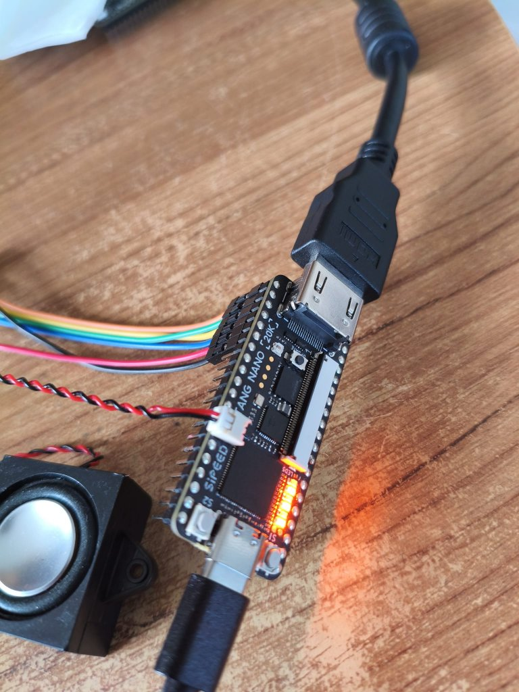
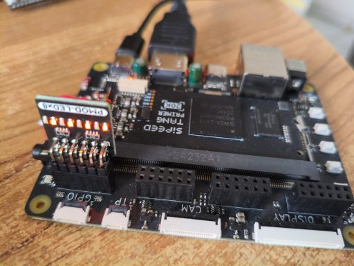
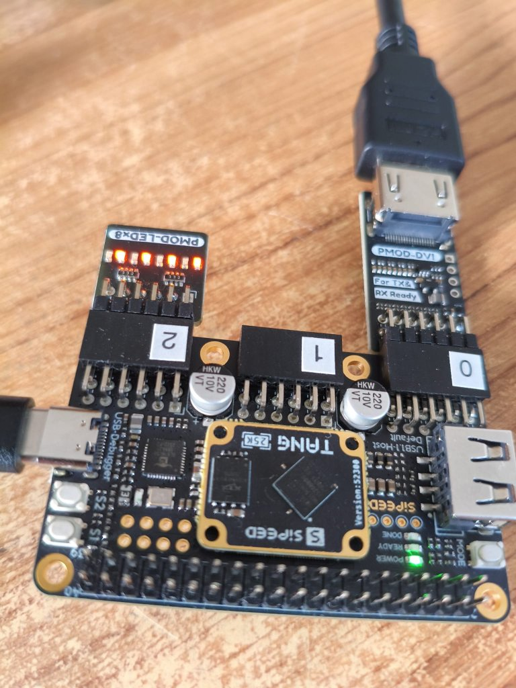

# PicoRV32 SoC for Sipeed Tang FPGAs

This project implements a RISC-V SoC based on the **PicoRV32** CPU, specifically optimized for the **Sipeed Tang Nano** and **Sipeed Tang Primer** series. It features a configurable memory architecture and an integrated HDMI text output.

## 🚀 Key Features

* **Processor:** PicoRV32 RISC-V CPU.
* **Boot Memory:** 8KB BSRAM.
* **Memory Expansion:** Up to 64KB BSRAM (configurable in 8KB steps).
* **Clock Management:** 
    * Automatic selection of clock settings and video parameters based on the target hardware.
    * Selectable CPU frequency: **24, 48, or 60 MHz** (depending on hardware capabilities).
* **Video Output:** HDMI Text Mode with 16 colors.
* **Peripherals:**
    * Simple 8-bit GPIO port.
    * Integrated UART (Serial console).
    * Timer with mode up/down counter.

	

## 📋 Supported Boards & Resolutions

| Board | CPU Freq (MHz) | 1360x768 @ 50Hz (80x32 char) | 1366x768 @ 60Hz (80x32 char) | 1680x1050 @ 60Hz (96x42 char) |
| :--- | :---: | :---: | :---: | :---: |
| **Tang Nano 9K** | 24 | ✅ | - | - |
| **Tang Nano 20K** | 24, 48 | - | ✅ | - |
| **Tang Primer 20K** | 24, 48, 60 | - | ✅ | ✅ |
| **Tang Primer 25K** | 24, 48, 60 (1) | - | ✅ | ✅ |

(1) 60.7MHz when usign 1366x768 résolution

## 🎨 HDMI Text Mode Colors

| Index | Color | Index | Color |
| :--- | :--- | :--- | :--- |
| 0 | Black | 8 | Dark Gray |
| 1 | Blue | 9 | Light Blue |
| 2 | Green | 10 | Light Green |
| 3 | Cyan | 11 | Light Cyan |
| 4 | Red | 12 | Light Red |
| 5 | Magenta | 13 | Light Magenta |
| 6 | Brown/Yellow | 14 | Yellow |
| 7 | Light Gray | 15 | White |

## 📊 Hardware Resource Utilization

To give you an idea of the footprint, here is how the PicoRV32 + HDMI Controller scales across different boards using the Gowin EDA

| Resource        | Tang Nano 9K | Tang Nano 20K | Tang Primer 20K | Tang Primer 25K |
|-----------------|--------------|---------------|-----------------|:---------------:|
| Logic (LUT/ALU) | 48%          | 21%           | 20%             | 22%             |
| Registers       | 21%          | 9%            | 9%              | 11%             |
| BSRAM           | 100%         | 100%          | 100%            | 83%             |
| DSP Blocks      | 20%          | 9%            | 9%              | 17%             |

### 📚 Credits
 * Boot Memory: Based on Grug Huhler's work. [picorv32](https://github.com/grughuhler/picorv32).
 * PicoRV32, UART: By Claire Xenia Wolf [picoRV32](https://github.com/YosysHQ/picorv32).
 * HDMI Core: Based on Sipeed's examples [HDMI](https://github.com/sipeed/TangMega-138K-example/hdmi_colorbar/eda_proj).
---

## 🛠️ How to Build

### Prerequisites
* **Gowin EDA:** For hardware synthesis and place-and-route.
* **RISC-V Toolchain:** To compile C/ASM code (e.g., `riscv64-unknown-elf-gcc`).

### Hardware Synthesis
1. Open the `.gprj` file in **Gowin EDA**.
2. Select your device in `Project -> Configuration`.
3. Check the `.cst` (Constraints) file to ensure it matches your board's pinout.
4. Run the synthesis and place-and-route to generate the bitstream.

## 📸 Hardware Setup & Connections

This section showcases the physical connections required to route the FPGA's differential signals to an HDMI connector for each board.

### Tang Nano 9K
This setup shows the standard connection used on the 9K board. 
<strong>Note: connect usb cable before hdmi!</strong>

  

### Tang Nano 20K (Recommended)
Do not care about connections on row-header!

  

### Tang Primer 20K
Implemented using the PMOD headers on the Primer baseboard.

  

### Tang Primer 25K
Implemented using the PMOD headers on the Primer baseboard. 
Leveraging the extra BSRAM of the 25K for advanced feature.

  

### Software Compilation
1. Navigate to the `c_code/` directory.
2. Run the **`build.bat`**
   
### ⚡ Quick Start
  Since all Tang boards feature onboard USB-JTAG and HDMI connectors:
  * Connect the board via USB-C for power first.
  * Programming.
  * Connect the HDMI port to your monitor.
  * Open your favorite serial terminal (115200 baud) to interact with the SoC.

   
